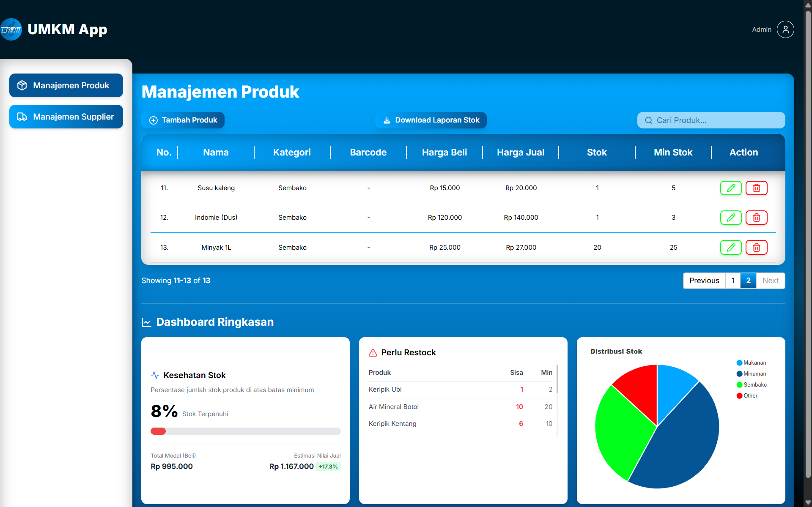

# UMKM Stock Management

Prototype aplikasi manajemen stok berbasis web untuk UMKM, dibangun dengan **Laravel** dan **SQLite**.


---

## Prasyarat

Sebelum memulai, disarankan sudah menginstal **Laravel Herd** di komputer Anda:

[Download Laravel Herd](https://herd.laravel.com/)

> Herd sudah menyertakan PHP dan semua servis yang dibutuhkan. Tidak perlu instal PHP atau web server secara terpisah.

---

## Cara Menjalankan dari Clone

### 1. Buka CMD di Folder Herd

Buka Command Prompt (CMD) dan arahkan ke dalam direktori tempat Anda menyimpan _project_ Herd. Contoh:

```cmd
cd C:\Users\<Username>\Herd
```

### 2. Clone Repositori

```bash
git clone https://github.com/fadhilahkhairogi/Stock-management-prototype umkm-stock
cd umkm-stock
```

### 3. Hentikan Servis Herd Sementara

> Menghindari konflik saat Composer menginstal dependensi.

```bash
herd stop
```

### 4. Install Dependensi PHP

```bash
herd composer install
```

### 5. Aktifkan Kembali Herd

```bash
herd start
```

### 6. Salin File Konfigurasi

```bash
copy .env.example .env
```

### 7. Generate Application Key

```bash
herd php artisan key:generate
```

### 8. Buka Aplikasi di Browser

Karena folder `umkm-stock` berada di dalam direktori yang dipantau Herd, URL sudah otomatis aktif. **Tidak perlu `php artisan serve`.**

```
http://umkm-stock.test/logistic/products
```

---

## Troubleshooting

- **Halaman tidak muncul**: Pastikan folder `umkm-stock` berada di dalam direktori Sites yang dikonfigurasikan di Herd.
- **Error 500**: Pastikan langkah `key:generate` sudah dijalankan dan file `.env` ada.
- **Cache stale**: Jalankan `herd php artisan optimize:clear` lalu refresh.
